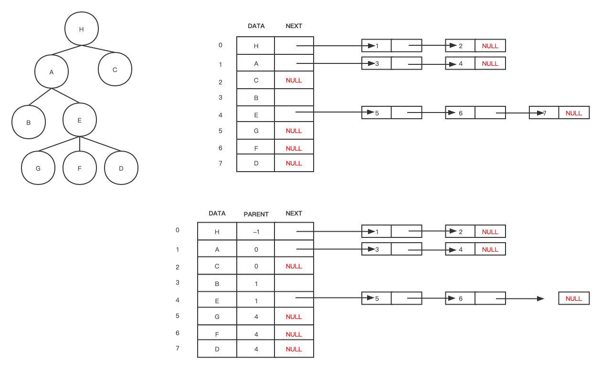
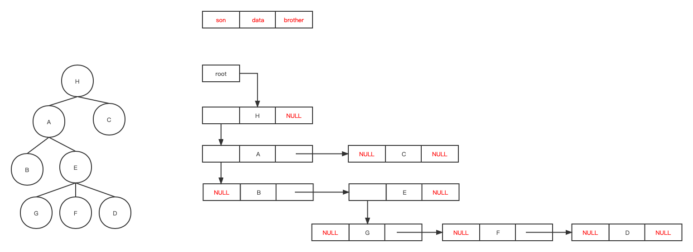
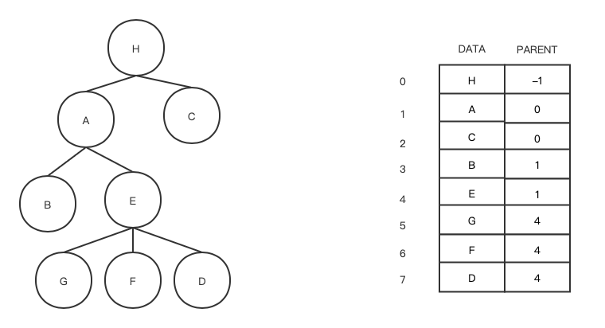

文中梳理了树的存储结构中的孩子链表表示法，孩子兄弟链表表示法和双亲表示法与代码实践。

# 树和森林
## 树的存储结构
### 孩子链表表示法

孩子链表表示法是树的一种存储结构。它的主体是一个数组元素个数和树中结点个数相同的一维数组。树上的一个结点 X 以及该结点的所有孩子结点组成一个带头结点的单链表，单链表的头结点有两个域：数据域，指针域。如图所示：



如果图所示树上所有结点按照某种顺序存入表头数组中，而各个结点的孩子信息存储在各结点的孩子链表中。显然，由孩子域的值可以在表头数组中迅速查处对应的孩子结点。

算法描述如下：

```cpp
const int maxed = 20;

  

typedef   struct   bnode{

  int child;

  struct bnode *next;

}node,*childlink;

  

typedef   struct   headnode{

  char data;

  childlink   hp;

  int   parent;//为方便寻找双亲。

}headnode;

  

headnode link[maxed];
```
### 孩子兄弟链表表示法

存储时每个结点处理数据结点外，还有指向该结点的第一个孩子和下一个兄弟结点的指针，如下图所示。值得注意的是孩子兄弟链表的结构形式与二叉链表完全相同，但是结点的含义不同（二叉链表中的结点分别执行左右孩子；而孩子兄弟链表中结点的指针分别指向孩子和兄弟结点）。



在孩子兄弟链表表示法中，结点形式统一，结点之间的关系比较简洁。同时，在存储结构上容易实现树的大多数运算。例如，要访问结点 X 的第 i 个孩子，只需要丛 X 的孩子域找到他的第一个孩子，然后沿着和这个孩子结点的兄弟指针连续扫描 i - 1 个结点即可。

算法描述如下：

```cpp
typedef   struct   sbnode{

  char data;

  struct sbnode *son,*brither;

}*SBTree;
```
### 双亲表示法
双亲表示法由一个一维数组构成。数组的每个分量包括两个域：数据域 和 双亲域（用于存储本结点的双亲结点在数组中的序号【下标】）。如图所示：



通过任意一个结点双亲域的值，可以找该结点的双亲。

算法描述如下：

```cpp
const int size = 10;

typedef   struct   pnode{

  char data;

  int parent;

}*Pnode;

Pnode slist[size];
```
