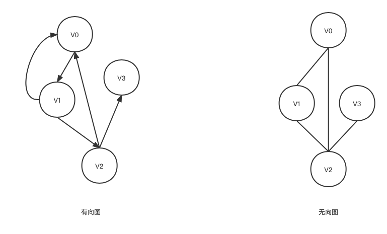
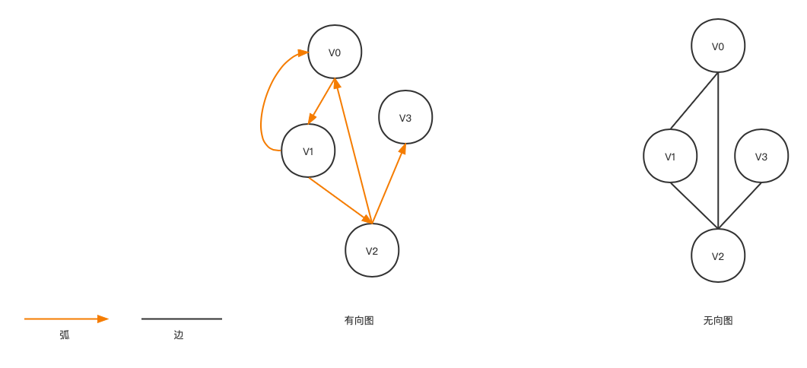
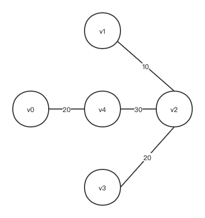
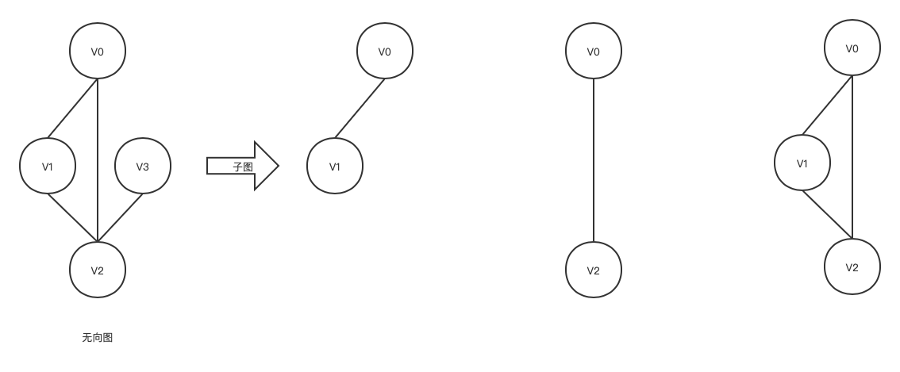
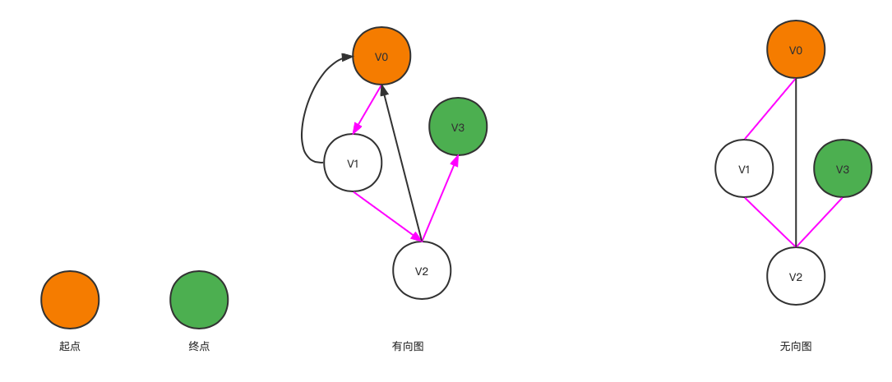
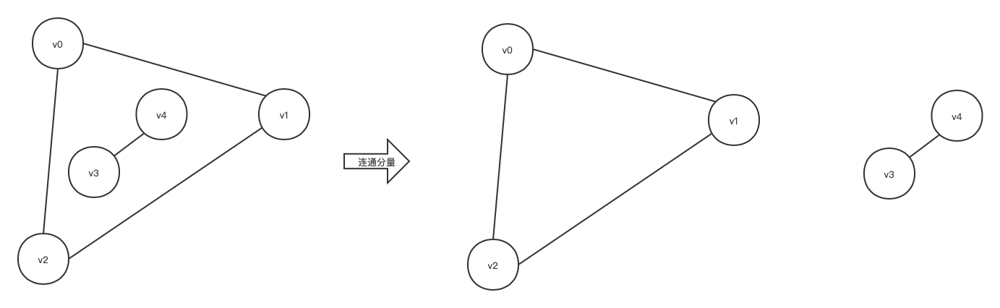
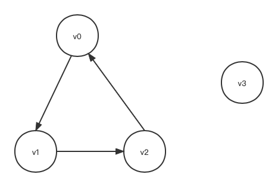

在[树](/2022-05-11-tree-structure)形结构中，结点之间具有层次关系，没一层结点只能和上一层中的至多一个结点相关，但可能和下一层多个结点相关，而在图的结构中，任意两个结点之间都可能相关，即结点之间的邻接关系可以是任意的。
图结构可以描述多种复杂的数据对象，应用广泛。

# 图论
##  有向图，无向图
图G由两个集合V和E组成，记$G=(V,E)$, 其中 V 是顶点的有穷非空集合；E是边的集合，边是V中顶点的偶对。若顶点的偶对是有序的则称为有向图，有偶对用尖括弧 "< >" 括起来；若顶点偶对是无序的，则称此图为有向图，无序偶对用圆括弧 “（）” 括起来。
- 偶对$<v,w>$ 表示有向图中从顶点 v 到顶点w有一条边，即 $v,w \in V;<v,w> \in E$。
- 偶对$(v,w)$ 表示有无向图中顶点 v到顶点w有一条边，即 $v,w \in V;(v,w) \in E$。

{: .mx-auto.d-block :}

弧，弧头，弧尾：有向图的边称为弧。
- 设 $v,w \in V$ ,若 $<v,w> \in E$,则有序偶对 $<v,w>$ 表示有向图中从v到w的一条弧，v称为弧尾或始点，w 称为弧头或终点。
- 如图有向图，有4个顶点和5条弧，$V= \{ V_0,V_1,V_2,V_3 \}$ , $E=\{<v_0,v_1>,<v_1,v_0>,<v_1,v_2>,<v_2,v_0>,<v_2,v_3>\}$  。
- 如图无向图，有4个顶点和4条边，$V= \{ V_0,V_1,V_2,V_3 \}$ , $E=\{(v_0,v_1),(v_1,v_2),(v_0,v_2),(v_2,v_3)\}$  。
- 在无向图中，若顶点v与w之间有边$(v,w)$,则v和w互为邻接点，称边$(v,w)$与顶点v和w相关联。
- 在有向图中，若顶点v与w之间有弧$<v,w>$,则v与w邻接，称弧$<v,w>$ 与顶点v和w相关联。

{: .mx-auto.d-block :}

任何两点之间都边的无向图称为无向完全图。
- 一个具有n个顶点的无向完全图的边数为：$C_n^2=n(n-1)/2$ 。

任何两点之间都有弧的有向图称为有向完全图。
- 一个具有n个顶点有向完全图的弧数为：$P_n^2=n(n-1)$。

 权，带权图：图的边附带数值，这个数值叫权，权是在应用中可以表示一个顶点到另外一个顶点的距离，代价或耗费等。每条边都带权的图称为带全图。

{: .mx-auto.d-block :}
 
 顶点的度，入度，出度：
 - 无向图中顶点v的度是与该顶点相关联的边的数目，记为$D(v)$。
 - 有向图中把顶点v为终点的弧的数目称为v的入度，记为$ID(v)$;把顶点v为始点弧的数目称为出度，记为$OD(v)$。
 - 有向图中的顶点v的度为入度和出度的和，即$D(v)=ID(v)+OD(v)$。

子图：设$G=(V,E)$ 是一个图，若$E^\prime$是$E$的子集，$V^\prime$是$V$的子集，并且$E^\prime$中的边仅与$V^\prime$中的顶点相关关联，则$G^\prime=(V^\prime,E^\prime)$ 称为图G的子图。

{: .mx-auto.d-block :}

路径与路径长度：
- 在无向图$G=(V,E)$ 中，从顶点v到顶点v'的路径是一个顶点序列：$V,V_{i_1},V_{i_2},...,V_{i_m},V^\prime$ 其中$(V,V_{i_1}),(V_{i_1},V_{i_2}),(V_{i_m},V^\prime)$  为图的边。
- 若有向图，则要求这个顶点的序列满足：$<v,V_{i_1}>,<V_{i_1},V_{i_2}>,...,<V_{i_m},V^\prime>$ 为图中的弧。路径上的边（或弧）的数目称为路径长度。

{: .mx-auto.d-block :}

简单路径，回路，简单回路：
- 序列中顶点不重复出现的路径称为简单路径。无向图中$v_0 \to v_1 \to v_2\to v_3$ 是简单路径
- 第一个顶点和最后一个顶点相同的路径称为回路或环。除第一个顶点和最后一个顶点外，其余顶点不重复的回路，称为简单回路或简单环。无向图中的 $v_0 \to v_1 \to v_2 \to v_0 \to v_2 \to v_0$   和 $v_0 \to v_1  \to v_2 \to v_0$ 都是回路，其中 $v_0 \to v_1  \to v_2 \to v_0$ 为简单回路。

连通，连通图，连通分量：
- 在无向图中，如果从顶点$v$到顶点$v^\prime$有路径，则称$v$ 和$v^\prime$ 是连通的。
- 如图中任意两个顶点$v_i$和$v_j$ 都是连通的，则称 G 为连通图。
- 连通分量是无向图中的极大连通子图。

{: .mx-auto.d-block :}

强连通，强连通图，强连通分量：
- 对于有向图来说，如果图中任意一对顶点$v_i$ 和$v_j$  $(i \neq j)$ 都有顶点 $v_i$ 到顶点 $v_j$的路径，也有从 $v_j$ 到 $v_i$的路径，即两个顶点双向连通，那么称该有向图是强连通的
- 有向图的极大连通子图称为强连通分量。

{: .mx-auto.d-block :}

生成树，生成森林：
- 一个连通图的生成树，是含有该连通图的全部顶点的一个极小连通子图。
- 若连通图G的顶点个数为 n ，则生成树的边数为 n -1 。如果G的一个子图$G^\prime$ 的边大于 n -1 ，则 $G^\prime$ 一定有环，相反，如果 $G^\prime$ 的边数小于 n-1，则  $G^\prime$ 一定不连通。
- 在非连通图中，每个连通分量都可以得到一个极小连通子图，即一颗生成树。那么这些连通分量的生成树组成一个非连通图的生成森林。

{: .mx-auto.d-block :}
