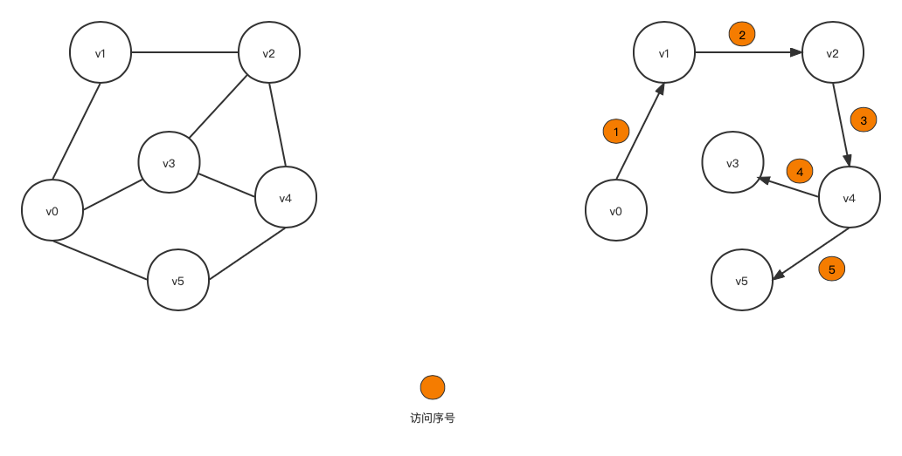
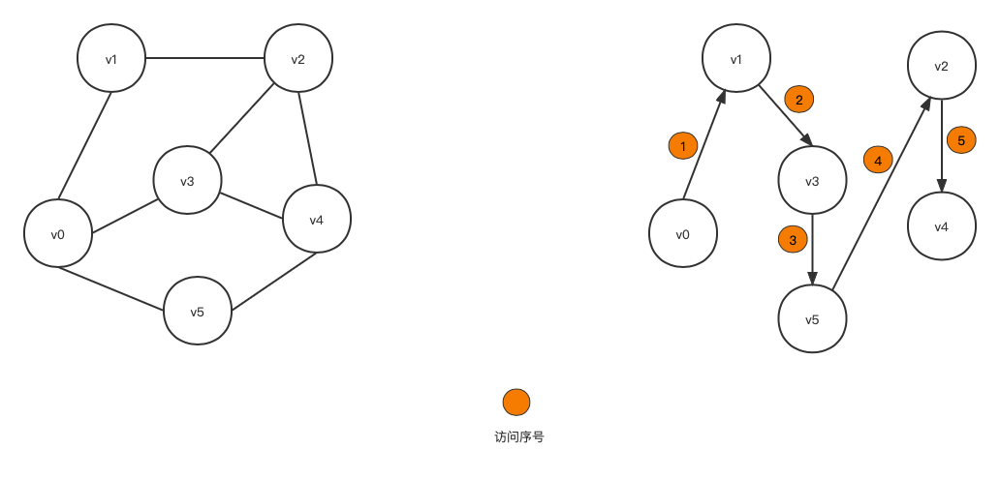

图的遍历是指从图的某个顶点出发，系统的访问图的每个顶点，并且每个顶点只被访问一次。遍历图的基本方法有两种：深度优先搜索和广度优先搜索。

# 图论
深度优先搜索和广度优先搜索都适用于有向图和无向图。

## 深度优先搜索
深度优先搜索的基本思想：假定以图中的某个顶点 $v_i$ 为出发点，首先访问 $v_i$ ,然后任意选一个 $v_i$ 的未被访问过的邻接点 $v_j$。以 $v_j$ 为新的出发点继续进行深度优先搜索，以此类推，直到所有的顶点都被访问过。深度优先搜索类似于树的先序遍历。过程如下：


需要注意两点：
- 搜索到达某个顶点时（图中仍有顶点未被访问），如果这个顶点的所有邻接点都被访问过，那么搜索要回到前一个被访问过的顶点，再从该顶点的下个未被访问的邻接点开始深度优先搜索。
- 深度优先的顶点访问序列不是唯一的。

算法描述如下：

```cpp
static int visited[n];

static void dfs(Graph g,int v){
    std::cout << "访问顶点 "<< v << "\n";
    visited[v] = 1;
    ArcNode *p = g.adjlist[v].firstarc;
    while (p!=NULL) {
        if(!visited[p->adjvex]){
            dfs(g, p->adjvex);
        }
        p = p->nextarc;
    }
}
```
visited 作为一个全局变量，在第一次调用 dfs 前，需要将数组的每个元素出事化为 0 。以[邻接表](/2022-06-01-graph-store)为存储结构，深度优先算法的时间复杂度为 $O(n+e)$,其中 n 是图中的顶点数量，
e 为图的边数。 如采用邻接矩阵作为存储结构，深度优先算法的时间复杂的为 $O(n^2)$ ,n 为图中顶点数量。


## 广度优先搜索
广度优先搜索的基本思想：从图中的某个顶点 $v_i$ 出发，在访问了 $v_i$ 之后依次访问 $v_i$ 的所有邻接点，然后依次从这些邻接点出发按广度优先搜索方法遍历图的其他顶点。重复这一过程，直至所有的结点被访问到。广度优先搜索类似于树的按层次遍历的过程。过程如下：



算法描述如下：

```cpp

const int bfsque_size = 20;

typedef struct bfsque{
   int data[bfsque_size];
   int front,rear;
}BfsQue;

//初始化
static void InitBfsQueue(BfsQue *CQ){
    CQ -> front = 0;
    CQ -> rear = 0;
}
//判断列空
static int EmptyBfsQueue(BfsQue *CQ){
    if(CQ ->rear == CQ ->front){
        return 1;//列为空
    }else{
        return 0;//列不为空
    }
}
//入队列
static int EnBfsQueue(BfsQue *CQ,int x){
    if((CQ -> rear + 1 ) % bfsque_size == CQ ->front){
        perror("队列已满");return 0;
    }else{
        CQ -> rear = (CQ -> rear + 1 ) % bfsque_size;
        CQ -> data[CQ ->rear] = x;
        return 1;
    }
}
//出队列
static int OutBfsQueue(BfsQue *CQ){
    if(EmptyBfsQueue(CQ)){
        perror("队列空");return 0;
    }else{
        CQ -> front = (CQ ->front + 1) % bfsque_size;
        return 1;
    }
}

//取队列首元素
static int GetBfsHead(BfsQue *CQ){
    if(EmptyBfsQueue(CQ)){
        return NULL;
    }
    return CQ -> data[(CQ -> front + 1) % bfsque_size];
}

static int bfs_visited[20];

static void bfs(Graph g,int v){
    std::cout << " " << v << " ->" ;
    BfsQue *bfsq = (BfsQue*)malloc(sizeof(bfsque));
    InitBfsQueue(bfsq);
    bfs_visited[v] = 1;
    EnBfsQueue(bfsq,v);
    ArcNode *p;
    while (!EmptyBfsQueue(bfsq)) {
        v = GetBfsHead(bfsq);
        OutBfsQueue(bfsq);
        p = g.adjlist[v].firstarc;
        while (p!=NULL) {
            if(!bfs_visited[p->adjvex]){
                std::cout << " " << p->adjvex << " ->" ;
                bfs_visited[p->adjvex] = 1;
                EnBfsQueue(bfsq,p->adjvex);
            }
            p = p->nextarc;
        };
    };
}
```

