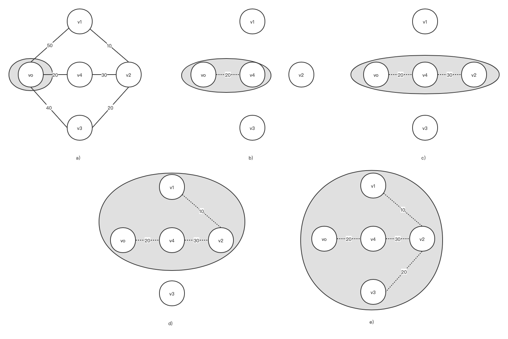
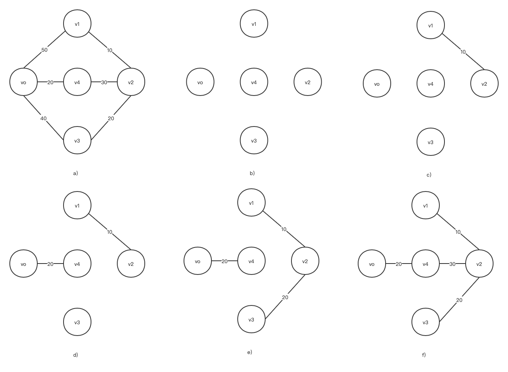
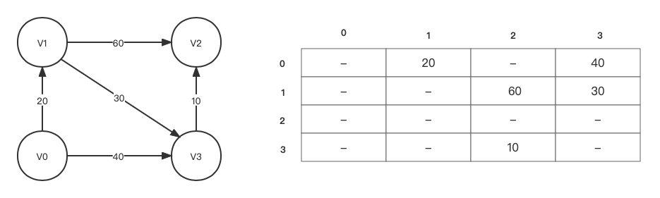

连通图的一次遍历所经过的边的集合及图中所有顶点的集合构成该图的一颗生成树。连通图的遍历序列不是唯一的，所以能得到不同的生成树。
一个图的最小生成树是图所有生成树中权总和最小的生成树。

# 图


##  Prim 算法-构造最小生成树
Prim算法的基本思想如下。假设 $G=(V,E)$ 是一个带权图，生成的最小生成树为 $MinT=(V,T)$其中 V 为顶点的集合，T 为边的集合。求T的步骤如下：
- （1）初始化：$U=\{U_0\},T=\{\}$ 。其中 U 为一个新设置顶点的集合，初始化中只含有顶点$u_0$。这里假设在构建最小生成树的时候，从顶点$u_0$出发。
- （2）对所有$u \in U,v \in V-U$ (其中u，v表示顶点) 的边$(u,v)$ 中。找出一条全最小的边$(u',v')$ 。将这条边加入集合 T，将顶点 $v'$ 加入集合U中。
- （3）如果$U=V$ 则算法结束；否则重复（2），（3）步骤  。



算法描述如下：

```cpp


```

##   克鲁斯卡尔方法
克鲁斯卡尔（Kruskal）算法是另一种构造最小生成树的方法，算法的基本思想如下：
- （1）.设 $G=(V,E)$, 令最小生成树初始化状态为只有n个的顶点而无边的非连通图$T=(V,\\{\\})$，每个顶点自成一个连通分量；
- （2）.在 E 中选取代价最小的边，若该边所依附的顶点落在T中不同的连通分量上，则将此边加入到T中，否则舍去此边，选取下一条代价最小的边。
- （3）.依次类推，重复（2），直到T中所有的顶点都在同一连通分量上为止。



算法描述如下：

```cpp


```

## 单源最短路径
Dijkstra 算法求单源最短路径的基本思想：
- （1）.设置顶点集合 S，开始时 S 中只含有源点 v。
- （2）.设 u 是 G 的某一个顶点，把从源点 v 到 u 且中间只经过 S 中顶点路径称为从源到u的特殊路径，并用数组 dist 记录从源点 v 到其他每个顶点所对应的最短特殊路径长度，dist[u] 初始值设置为弧$<v,u>$ 的值，若弧不存在，则设置dis[u]的初始值为 $\infty$。
- （3）. Dijkstra 算法每次从 $V-S$ 中取出具有最短特殊路径长度的顶点 u，并将 u 添加至 S 中，如果 $dist[u] + g.arcs[u][j] < dis[j]$，则对数组 dist 做必要修改，将 dist[j] 的值修改为 $dis[u] + g.arcs[u][j]$ ，这里 $g.arcs[u][j]$ 表示图中弧 $<u,j>$的权值。
- （4）.当 S 包含了所有V中的顶点时，dist 就记录了从源点到其他顶点的最短路径长度，即dist[u] 表示最终从远点 v 到顶点u 的最短路径长度。

{: .mx-auto.d-block :}

| 步骤  | S             | u | dist[1] | dist[2] | dist[3] |
|:---:|---------------|---|---------|---------|---------|
| 第一步 | {v0}          | - | 20      | MAX_INT | 40      |
| 第二步 | {v0,v1}       | 1 | 20      | 80      | 40      |
| 第三步 | {v0,v1,v3}    | 2 | 20      | 50      | 40      |
| 第四步 | {v0,v1,v3,v4} | 3 | 20      | 50      | 40      |

算法描述如下：

```cpp
  
  
```
