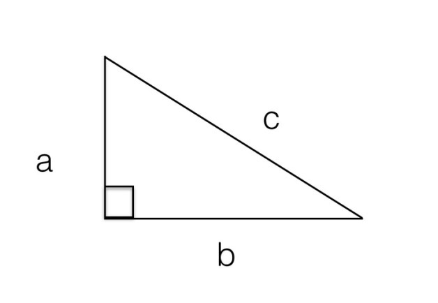
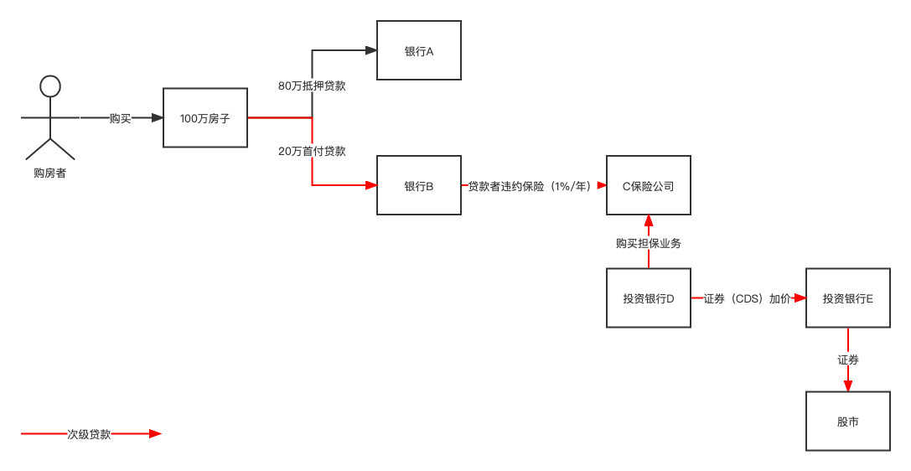

数学发展和体系构建常常经历的步骤，也就是，从特例到引理再到定理、推论，最后到应用的全过程。

# 数学通识

## 数学的线索

###  毕达哥拉斯定理（勾股定理）
直角三角形两条直角边的平方之和等于斜边的平方。

$$
a^2 + b^2 = c^2
$$

那么我们就要说到数学和自然科学的三个本质差别，也是最重要的三个知识点，它们能够帮助我们理解数学特殊的方法和思维方式，或者说了解数学的推理世界与我们真实的测量世界的区别。

- 测量和逻辑推断的区别。
- 用事实证实和用逻辑证明。
- 科学结论的相对性和数学结论的决对性。

要点总结
> 数学和自然科学不同，它不相信测量，不是建立在实证基础之上，而是建立在逻辑基础之上的。数学也不接受大部分情况正确，但是包含例外的定理。这样整个数学大厦的基础才得以稳固。数学定理确立的过程大致是这样的，一开始可能只是大家注意到几个特例，然后发现很多例证提出猜想，猜想经过证明就成为了定理，定理会有推论，在此基础上，会有新的定理和应用。

### 无理数(反证法)
数学的定理具有永真的特点，它一旦被证明，你就找不到反例。当人们在用毕达哥拉斯定理时，就发现了问题。假设某一个直角三角形的两条直角边长都是1，那么斜边该是多少呢？
根据毕达哥拉斯定理算一下，既然两条直角边都是1，它们各自的平方也是1，加起来是2，因此斜边的平方是2，这个斜边就是一个自己乘以自己等于2的数字，从大小来看，它应该在1和2之间。接下来请问，这个自己乘以自己等于2的数字是否是“完美”的有理数？

我们就假定存在一个数字是R，它能够写成R=A/B的形式，其中A、B都是互素的整数（互素指的是两个数写成分数的形式，不可再约分），那么现在假设这个数字R的平方恰好等于2。有三个条件：
- A、B都是整数。
- A、B互素，也就是不能再约分了。
- A/B的平方等于2。

采用反证法（就是先假定你说的条件都满足，然后我来找出矛盾之处，这样就能推翻原来的假设）。

推导过程：

1.具体到上面这个问题，从上面第三个条件出发，就得知分子A的平方除以分母B的平方等于2：

$$
\frac{A^2}{B^2}=2
$$

转换为：

$$
A^2=2 \times B^2
$$

因此得出A时偶数，由于 $A^2$ 是偶数（奇数的平凡不可能时偶数），假设 $A=2\times C$ 得出新的公式：

$$
4\times C^2 = 2 \times B^2
$$

等式两边同时除以 2 得出：

$$
2\times C^2 = B^2
$$

因此得出 B 是偶数，这就和上面第二个条件“A、B互素，也就是不能再约分了。” 矛盾了。

也就是说，存在一种数字，我们过去没有认识到，它们无法写成有理数的形式，即A/B，它们是无限的不循环小数，在这样的数中有一个自己乘以自己时等于2。我们今天把这个数字称为$\sqrt 2$。这一类的数字其实很多，它们被统称为无理数。

要点总结：
> 从数学的定理出发，可以推导出很多针对现实世界的推论，从而改变我们对现实世界的看法，这就是数学的预见性。比如，毕达哥拉斯定理的一个直接结果指出了无理数的存在，它把人类对于数字的认识范围从有理数扩展到了无理数。

### 从逻辑出发想问题(矛盾律)
数学思维高深精妙，但是万法归一，最重要的那个原则就是，从逻辑出发想问题，这样就可以发现很多日常中被忽略的问题，从而找出真正答案。

2008年金融危机的原因是美国房屋的次级贷款出了大问题，那它和CDS有什么关系呢？如图所示：

这个骗局的本质是什么呢？就是大家炒来炒去，都是在赌一件事，就是今后15~30年，房价会一直快速上涨。

然而，房价不可能永远快速上涨，特别是在经济本身没有上涨的前提下。一旦有大量房主还不上钱，或者不愿意还钱，这些CDS就变得一钱不值。更糟糕的是，给购房者提供次级贷款的银行，后面的保险公司以及很多购买了CDS的投资银行也都完蛋了，整个金融体制就垮了。

常常说“算笔账”这三个字。其背后其实就是说基于一些事实，用数学这个工具来考量，发现问题。为什么数学思维可以很容易地发现问题呢？因为我们常常用到在数学证明中的工具：矛盾律。

就是说一个事物不能既有A属性，又没有A属性。比如在证明$\sqrt 2$是无理数时，如果它是有理数P/Q，那么P和Q这两个整数，既不能同时是素数，又必须同时是偶数，这就违背了矛盾律。

要点总结：
> 通过数学的思维方式，发现生活中的问题，看清我们必须采取的行动，这就是学习数学的意义所在。这既可以被看成是认知的升级，也可以被认为是掌握了数学原理之后的灵活应用。

### 费马大定理（边界）

毕达哥拉斯定理：

$$
a^2 + b^2 = c^2
$$

费马大定理：

$$
a^n+b^n=c^n
$$

希尔伯特第十问题

$$
2x^2+3y^3=z^4
$$

或者

$$
x^2+3y^3-w^5=z^4
$$

要点总结：
> 希尔伯特第十问题是一个硬的边界，不要试图逾越。但是数学的边界有些时候不是我们解决问题的边界，因为世界上除了数学的方法，还有其他方法。

### 应用
#### 黄金分割（1.618）

毕达哥拉斯学派的人在做正五边形和五角星的图形时，发现了黄金分割的比例。在正五角星中，每一个等腰三角形的斜边和底边的比例都是黄金分割1.618。更精确地讲，是$\sqrt 5$加上1之后的和除以2，这是一个无理数，通常用希腊字母 $\phi$ 来表示。

要点总结：
> 数学和艺术，以及其他的知识体系有着千丝万缕的联系。有些方法你只要记住就好。

#### 优选法
所谓线性规划，就是用很多线性方程在多维空间里划定一个区域，在区域里找最佳值。

优选法的原理就是基于黄金分割，因此华先生（华罗庚）又称之为“0.618法”。

假定影响结果的变量（华先生称之为因子）只有一个，比如做馒头时放碱的量。假定1公斤面粉，放碱的重量范围为0～10克之间，精准度到0.1克。
当然碱放得太多太少都不行。我们还假定用不同碱量做出来的馒头的口味是可以量化度量的：

根据优选法，第一次试验取在黄金分割点，也就是0～10克之间6.18克的位置。如果我们发现这样做出来的馒头碱多了，那么怎么办呢？根据华先生的优选法，
第二次做试验选择从0到6.18克之间的黄金分割点。

黄金分割有一个特别好的性质，就是(1-0.618)/0.618=0.618，这样一来，0到6.18克的黄金分割点正好是10-6.18 = 3.82克的位置，这就使得这前后两次找到的黄金分割点，6.18和3.82中间出现了中间点，恰好是5.0克，也就是说5.0成了两次黄金分割点的对称点

在实际应用中，很多问题有多个变量，而不只是一个。优选法对这种问题设计了一种二维的折纸法，具体做法大致是这样：

1. 先确定第一个维度的黄金分割点；
2. 再确定第二个维度的黄金分割点，这样就把二维空间划分为四个部分；
3. 接下来确定第一个维度的第二个黄金分割点；
4. 再确定第二个维度的第二个黄金分割点。

重复第三、第四个步骤，直到找到最佳点。

