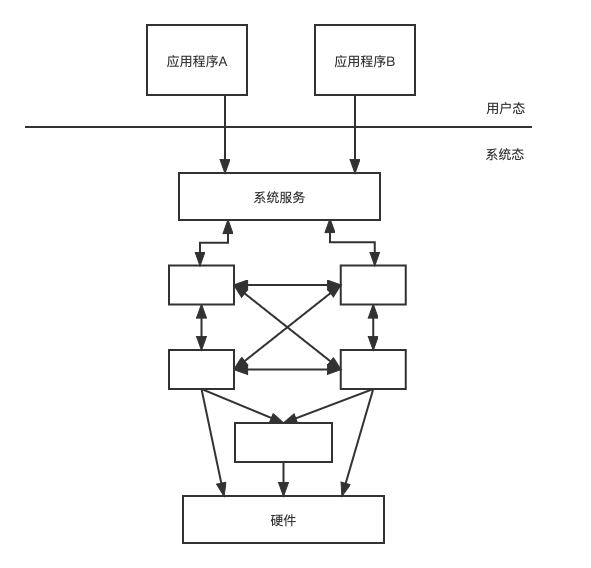
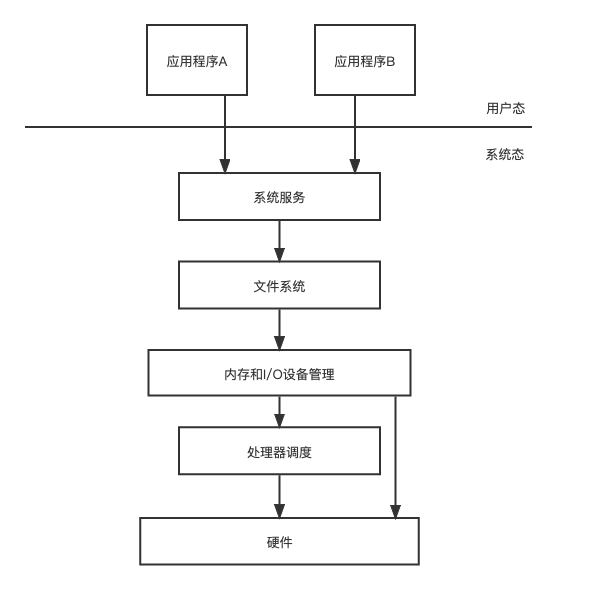
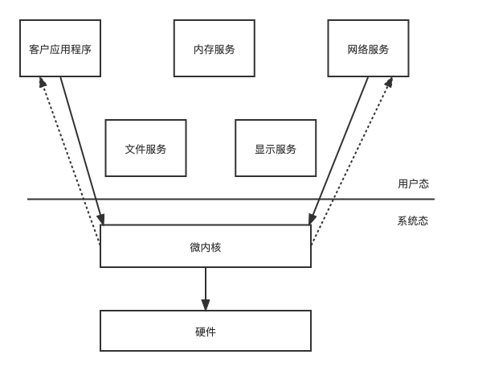

操作系统体系结构研究整个操作系统内各组成部分，以及成分间和成分内部存在的相互关系。在操作系统的发展过程中，产生了许多不同类型的体系结构模型，它们各有其适用范围。

# 操作系统

##  体系结构
应用需求的变化和硬件体系结构的不断发展对操作系统的可靠性，可扩充性，可移植性及开放性都提出了更高的要求。

###  简单的程序监控模型
这种系统应用与[单道批操作系统](/2022-06-13-Operating-System)之上，特点是：任意时刻系统中只能运行一个任务，保证了对系统信息的互斥访问，保护了系统的安全。主要问题就是系统缺乏“可伸缩性”，降低了系统潜在的并发性，从而降低的系统的效率。

典型代表：FMS（FORTRAN Monitor System） 和 IBSYS

### 单体结构模型
在单体结构模型中，所有软件和数据结构都放在一个逻辑模块中，对外层的用户程序提供一个完整的内核界面（系统调用）。它的特点是结构简单，便于实现和理解，系统所有部分都集中在一个内核中，效率高。缺点是：各子程序之间的调用关系复杂，容易引起循环调用和死锁。随着软件工程的提出和发展，借助软件工程的模块化思维，操作系统内核结构被划分成了不同的模块，模块之间仅能过通过各自定义良好的对外接口进行通信，不能访问各种模块内部的变量。

典型代表：UNIX，MS-DOS，Linux，Mac oS X 和 BSD

{: .mx-auto.d-block :}

### 层次结构模型
层级结构的基本思想是将操作系统分解为多个小的，容易理解的层，系统功能被隔离到不同的层中，每一层都提供对系统功能的部分抽象，然后采用单向调用顺序，形成一串彼此连续的对系统功能的抽象串，最终形成对整改系统的完整抽象。这样组织的好处是方便了操作系统实现，调试，测试。“分层” 结构使操作系统中的个模块之间的组织和依赖关系清晰明了。系统的可读性，可靠性，可移植性，都得到了增强。请问题是如果分层力度越小，性能越差。

典型代表：THE
{: .mx-auto.d-block :}

### 客户/服务器模型与微内核结构
微内核技术是操作系统发展的一个了里程碑，它的核心思想是核心功能外移，及把传统操作系统内核中的一些组成部分（如文件系统，网络，和驱动程序）放在内核之外作为一个独立的服务进程来实现，在微内核中只保留了操作系统的基本功能。
微内核结构是用一种水平分层的结构代替传统的纵向分层的机构。带来好处就是系统结构清晰，具有较高的灵活性，可靠性，可维护性。但微内核设计有个严重的缺陷就是效率不高：微内核采用消息传递机制来实现组件的通信，消息的收发的代价远比传统操作系统的要高。

典型代表：Window NT，COS-IX V2.3（中国），WinRiver，Vxworks。

{: .mx-auto.d-block :}

灵活性：
> 只要接口规范，操作系统可以方便的增加和删除服务功能。

可靠性
> 服务器进程运行在独立的用户进程空间中，某个服务出现问题，不会引起系统其它服务的，甚至是系统的崩溃。

可维护性
> 微内核体积小，便于测试，管理，和维护，修改服务代码不会影响其它部分。

### 动态可扩张结构模型（前景广阔）

动态可扩张结构模型的思想就是在运行过程中，能过动态的实现系统行为的扩展结构，也称为弹性结构。首先解决的问题就是如何实现系统行为的动态改变，目前的实现方式就是通过动态的增删系统代码（采用技术UPCALL 和 DOWN LOAD）。

典型代表：Exokernel（MIT ）。