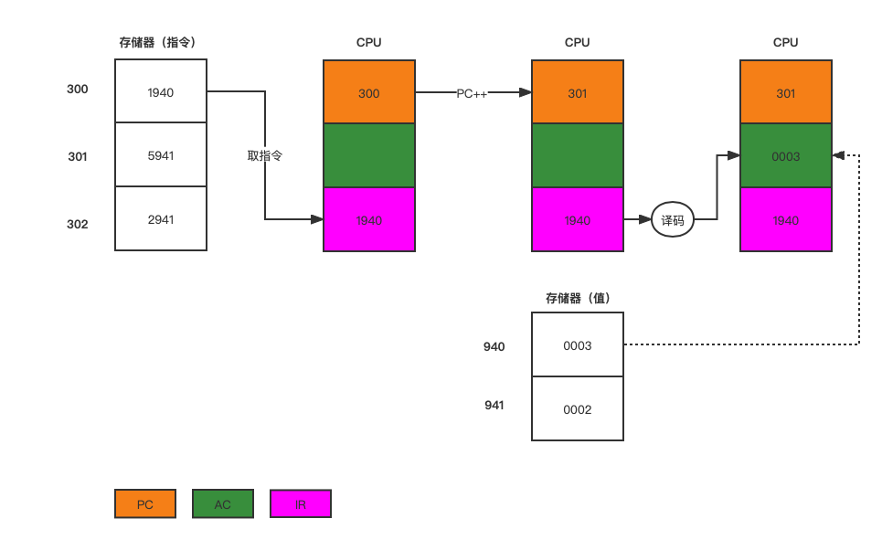
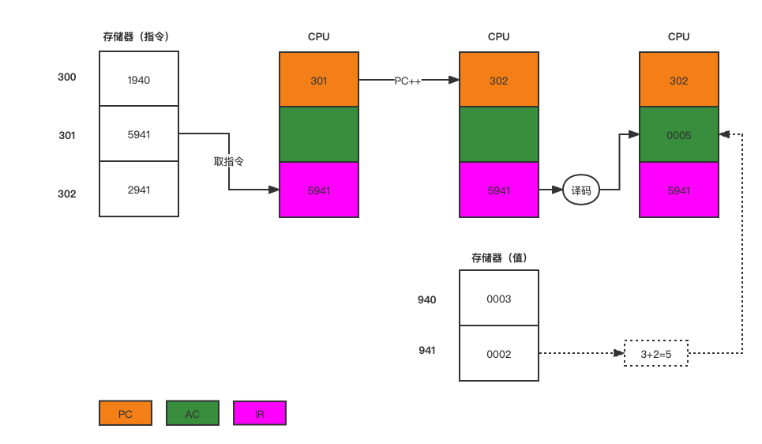
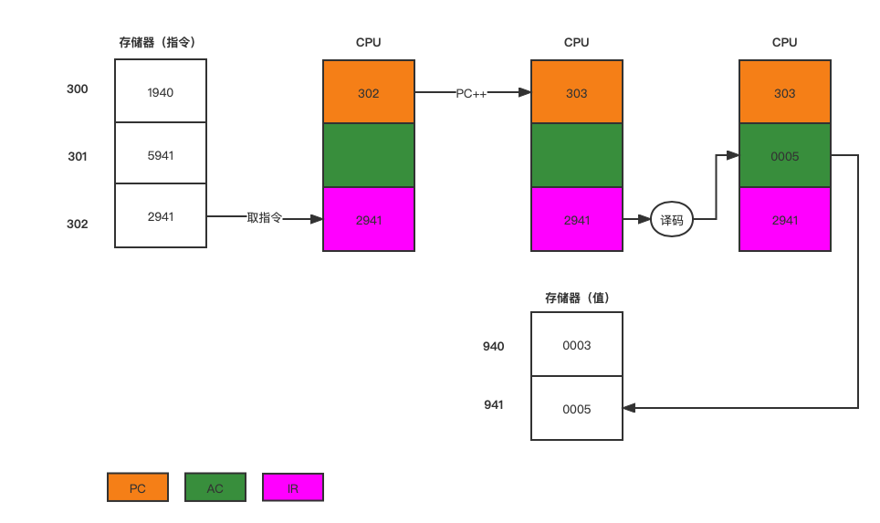

程序是指令的集合，程序的执行就是按照某种控制流程执行指令的过程。

# 操作系统

##  指令执行
### 指令周期
一个单一指令需要的处理称为指令周期，一个指令周期可以划分为：取指周期，执行周期。

#### 取指令
在每个指令周期开始时，处理器从存储器中取一条指令。在典型的固定长度指令处理器中，程序计数器（PC）保存下一个需取的指令的地址。除非接受的别的指示，否则处理器每次完成取指操作后是对PC递增，使它能够按照顺序取得下一条指令。

#### 执行指令
取到的指令放置在处理器中的指令寄存器（IR）中。指令中包含了处理器将要采取的动作位，处理器解释指令并执行要求的动作，这些动作包括4类：
1. 处理器与存储器之间的指令或数据传输操作。
2. 处理器与I/O设备之间指令或数据传输操作。
3. 算术运算操作或逻辑运算操作。
4. 控制操作，即修改指令的执行顺序的操作。

执行语句：

$$
a(941) = a(941) + b(940)
$$

指令集合：

$$
moveAC,(940);1940
$$

$$
add AC,(941);5941
$$

$$
move(951),AC;2951
$$

执行过程如图所示：

