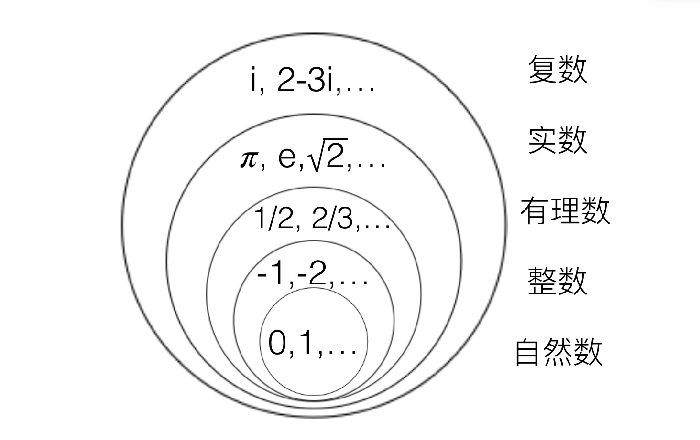
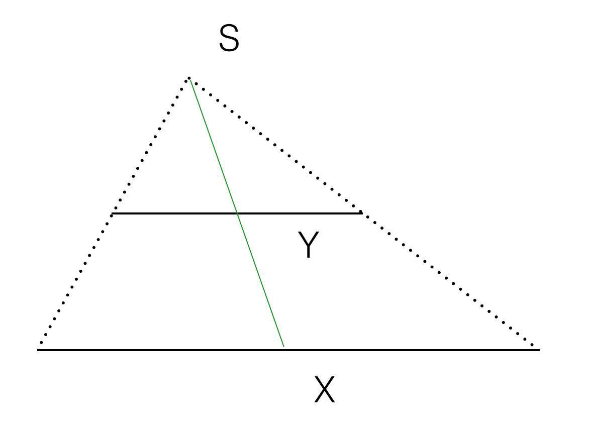
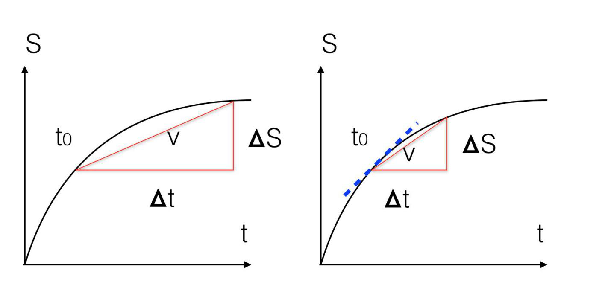

数学的世界，在很大程度上可以被看成是我们这个真实世界高度抽象的结果，它的概念是对我们生活中各种对象的浓缩，它的规律是我们生活中很多规律的抽象表述。

# 数学通识
## 数学的概念

### 鸡兔同笼
在一个笼子里，有鸡和兔子，从上面数，数出来35个头，从下面数，数出来94只脚，请问鸡和兔子各有几只？

| 兔子的数量 | 23  | 22  | 21  | 20  | .... | 13 | 12 |
|-------|-----|-----|-----|-----|------|----|----|
| 鸡的数量  | 12  | 13  | 14  | 15  |      | 22 | 23 |
| 脚的数量  | 116 | 114 | 112 | 110 |      | 96 | 94 |

我们用鸡兔同笼问题，说明了数学的本质是工具。笨办法，但是从工具的角度讲却是一个好工具。

###  虚数
那么虚数除了解三次方程还有什么用？它的用途可以归结为三个层面。

1. 第一个层面是对于数学本身的影响。
引入虚数的概念后，数学的一些逻辑上可能的漏洞就被补上了。比如说，在实数的范围内，$X^2+1=0$是无解的，这样一来，有的多项式方程有解，有的无解，数学就不完美了。引入一个虚拟的概念，虚数 $i$ ，就让所有的方程都变得有解了。更漂亮的是，引入虚数的概念后，所有的一元N次方程都会有N个解，没有例外。

2. 第二个层面是作为工具的作用。
有了虚数之后，很多复杂的数学问题，可以用简单的方法解决，但是并不是它最大的用途。虚数作为数学工具最大的用途，可能是便于将直角坐标变成极坐标。

3. 第三个层面是应用层面。
量子力学、相对论、信号处理、流体力学和控制系统的发展都离不开虚数。

认识数的过程用一张图表示出来，它是从中心往四周扩散的!

{: .mx-auto.d-block :}

1. 人类早期认识的数字都是正整数，$1，2，3，4, \ldots$ 因为大家接触到的周围的世界就是这样实实在在一个又一个的东西。

2. 接下来有了数字就要做运算，两个自然数相加或者相乘，结果还是自然数。但是，到做减法和除法时就出现了问题，因为$2-3=?，2/3=?$在自然数中找不到。于是人们就发明了负数和分数（就是有理数）的概念。这两个概念就比自然数要抽象一些了。

3. 很多人觉得数学越到后来越难学，就是没有能突破抽象思维的瓶颈。有了正负的概念，有了分数的概念，就形成了有理数的概念，加减乘除和乘方五种运算就都没有问题了。自从毕达哥拉斯定理被发现，人类就不得不面对开方这件事，就不得不定义出无理数。

4. 再往后，又因为要对负数开方，便发明了虚数的概念。实数和虚数合在一起，就形成了复数。

### 无穷小
证明一条长5厘米的线段上的点，和一条长10厘米线段上的点是“一样多”的。

{: .mx-auto.d-block :}
在图中，下面的线段长度是10厘米，上面的是5厘米。我们将它们平行放置，于是将它们两端相连（虚线），就会交会到一个点S处。接下来，对于10厘米长线上的任意一个点X，我们将X和S相连，就和5厘米短线有一个交点，我们假设为Y，这就说明长线上的任意点，在短线上都可以找到对应点。
因此，短线上的点应该不少于长线上的点。这样，在无穷大的世界里，我们可以认为10厘米线段上点的数量和它的一个子集，即5厘米线段上的点是“相同的”。当然更准确的说法是基数相同。

假如有三个完全相同功能的算法，A、B和C。

1. 算法A要进行100,000*N次运算； 
2. 算法B要进行N^2次运算； 
3. 算法C要进行N次运算。

### 芝诺的四个著名的悖论

#### 悖论一（二分法悖论）：从A点到B点是不可能的。
芝诺讲，要想从A到B，先要经过它们的中点，我假设是C点，而要想到达C点，则要经过A和C的中点，假设是D点 $\dots$这样的中点有无穷多个，找不到最后一个。因此从A点出发的第一步其实都迈不出去。

#### 悖论二（阿喀琉斯悖论）：阿喀琉斯追不上乌龟。
我们知道阿喀琉斯是古希腊神话中著名的飞毛腿，但是芝诺讲如果他和乌龟赛跑，只要乌龟跑出去一段路程，阿喀琉斯就永远追不上了。

在阿喀琉斯悖论中，芝诺其实把阿喀琉斯追赶的时间分成了无限份，每一份逐渐变小却又不等于零。
比如我们假设阿喀琉斯一秒钟跑10米，那么芝诺所分的每一份时间就是1秒、0.1秒、0.01秒，等等。
如果我们把它们加起来，就是等比级数。
接下来的问题是，这样无限份的时间加起来是多少？假如每一份时间都存在一个最小的、具体的长度，那么这样子的无限份加起来显然就是无限大，这是矛盾所在。
但是，如果我们能够定义一个被称为“无穷小”的量，它满足这样两个条件，芝诺的悖论就能够解决了。
1. 它不是零；
2. 它的绝对值小于任何一个你能够给定的数。比如你说$10^{-100}$（10的负100次方就是10的100次方分之一）非常小，那么我这个无穷小比你说的还小，如果你说再来一个更小的数$10^{-10000}$，那么我这个无穷小依然比你的数字小。
当我们把时间分为无穷多份之后，到后来，不仅每一份是一个无穷小量，而且无穷多个无穷小量加起来依然是无穷小。

那么怎么证明在上面的等比级数S中，无穷多个无穷小量加起来不会是无穷大呢？这在数学上有好几种方法可以证明，提示两个要点：
1. 无穷多个无穷小量加在一起可以有三种情况，分别是一个有限的数，无穷大，或者是无穷小，我们在后面介绍无穷大和无穷小的比较时会详细讲。
2. 在这个具体情况中，无限个无穷小量加起来是一个有限的数，这一点我们在后面讲到极限的概念时会说明，S这个级数的极限是10/9。

因此引入了无穷小的概念，就解决了阿喀琉斯悖论。

#### 悖论三（飞箭不动悖论）：射出去的箭是静止的。

在芝诺的年代，运动最快的是射出去的箭。但是芝诺却说它是不动的，因为在任何一个时刻，它有固定的位置，既然有固定的位置，就是静止的。而时间则是由每一刻组成，如果每一刻飞箭都是静止的，那么总的说来，飞箭就是不动的。
如果你2小时走了10公里，速度V就是每小时5公里，更确切地讲，就是位移的距离$\Delta S =10$公里除以完成这段位移的时间$\Delta t2$ 小时，即$V=\Delta S \div \Delta$。

如果我们想知道某一时刻特定的速度怎么办呢？牛顿说，当间隔的时间 $\Delta t$ 趋近于零的时候，算出来的速度就是那一瞬间的速度。

{: .mx-auto.d-block :}

在图中，横轴代表时间变化，纵轴代表距离变化。从 $t_0$ 这个点出发，经过  $\Delta t$ 的时间，走了 $\Delta S$ 的距离，因此在那个点的速度大约是$\Delta S / \Delta t$。这个比值，就是图中那个红色三角形斜边的斜率。

对比左图和右图，你会发现如果 $\Delta t$ 减少，$\Delta S$也会缩短，但是 $\Delta S / \Delta t$ 的比值就更接近 $t_0$ 那一瞬间的速度。极限的情况则是 $\Delta t$  趋近于零，那么时间-距离曲线在 $t_0$ 点切线的斜率就是  $t_0$ 的瞬间速度。
由此，牛顿给出了一个结论，时间-距离曲线在各个点切线的斜率，就是各个点的瞬间速度。

有了瞬间速度的概念，我们就很好解释芝诺的第三个悖论。

> 牛顿把上面这种数学方法推广到任意一个曲线。他将一个曲线在某一个点的变化率，定义成一个新的数学概念，今天我们在数学上称之为导数，导数是微积分的基础。

#### 悖论四（基本空间和相对运动悖论）：两匹马跑的总距离等于一匹马跑的距离。

如果有两匹马分别以相同的速度往两个方向远离我们而去，我们站在原地不动。在我们看来，单位时间里它们各自移动了一个单位 $\Delta$（  $\Delta$ 通常表示增量），显然一匹马跑出去的总距离就是很多$\Delta$相加。但是如果两匹马上有人，那么在彼此看来，对方在单位时间却移动了两个$\Delta$长度，彼此的距离应该是很多两倍的 $\Delta$ 相加。那么，如果 $\Delta$ 非常非常小，小到无限接近于零，芝诺就干脆认为$\Delta$=0，0乘以任何数还是0，那么$1\Delta = 2\Delta$。

芝诺所说的$\Delta$，其实就是无穷小，虽然它趋近于零，但是不等于零，因此$\Delta \neq 2\Delta$。

### 极限
我们先来看一个序列：
$$
1，4/3，6/4，8/5，10/6 \dots 2N/（N+1）\dots
$$
如果当N足够大时，它的值是多少？

1. 柯西对极限给出的直观的定义：
它的极限是2，因为它无限逼近2。

2. 魏尔斯特拉斯给出了他的定义法：
任意给一个小的数字 $\epsilon$，如果总能找到一个数字M，当N比M大之后，上面那个序列和2的差距小于 $\epsilon$。于是，我们就说上面那个序列的极限的是2。 

魏尔斯特拉斯采用了逆向思维,他先这么问大家： 你们觉得误差多么小算是趋近了？大家可能就说了，总得小于一亿分之一吧。

魏尔斯特拉斯就说，这容易做到，只要N大于一亿之后，这个序列和2的差距，就小于你说的一亿分之一了。
这时，你可能说，且慢，一亿分之一的误差还是误差啊，在数学上它还是不等于2。
魏尔斯特拉斯就说，没关系，你再说一个更小的数，我还能做到。于是你说$10^{-100}$。
魏尔斯特拉斯说，N大于$10^{100}$就可以了。总之，不管你说的数多么接近，他都能做到。这就是无限逼近。

