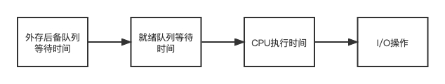
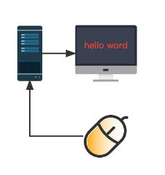

进程调度功能是由操作系统内核的进程调度程序完成的，在Liunx内核中，进程调度功能的实现是从调用内核函数 schedule 开始。进程调度功能是按照某种策略和算法从就绪队列为当前空闲的CPU选择在其上的运行的新进程。

# 操作系统

##  进程调度算法

进程调度算法是指从就绪态进程中选择一个或几个进程为其分配CPU，使其进入执行态算法。

### 选择调度方式和算法的若干准则

#### 周转时间短
周转时间是指作业被提交给系统开始，到作业完成为止的这段时间间隔。它包括 4 部分时间：
作业在外存后备队列上等待调度时间，进程在就绪队列等待进程调度的时间，进程在CPU上的执行时间，及进程等待I/O操作完成的时间。

平均周转时间和带权周转时间来衡量系统的时间性能。

如果系统冲有 n 个作业，系统的平均周转时间 T 等于 n 个作业的周转时间之和除以 n。

$$
    T = \frac{1}{n}  \bigl [ \sum_{i=1}^n T_i \bigr ] 
$$

作业周转时间 T 与 系统为他提供服务的时间 $T_s$ 之比 W ，$W = T/T_s$ 被称为带权周转时间，n 个作业的平均带权周转时间表达式如下：

$$
W = \frac{1}{n} \bigl[ \sum_{i=1}^n \frac{T_i}{T_s}\bigr]
$$

服务时间$T_s$  是一个作业在CPU上的执行总时间。

#### 响应时间快
响应时间是指用户从提交一个时间开始指到系统首次产生响应的时间为止的一段时间。包括3部分：从输入设备，输入请求的请求消息传送的处理机的时间，处理机对请求信息进程处理的时间，将所形成的响应信息回送到终端显示的时间。

{: .mx-auto.d-block :}

#### 截止时间的保证 
截止时间是指某个任务必须开始的最迟时间，或者必须完成的最迟时间。截止时间是评价实时系统性能的重要指标。

#### 系统吞吐量
吞吐了是指单位时间内完成的作业数。系统的吞吐量是评价系统性能的重要指标之一，调度算法影响系统的吞吐量。

#### 处理机利用率好
CPU是计算机系统中影响时间性能的最重要的硬件资源，在多任务系统中，进程调度算法对CPU的利用率有很大的影响，因此，在选择和设计进程调度算法时应考虑CPU的利用率尽可能高。