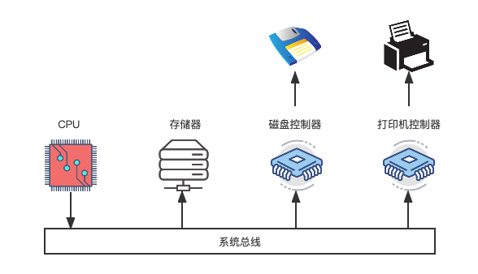
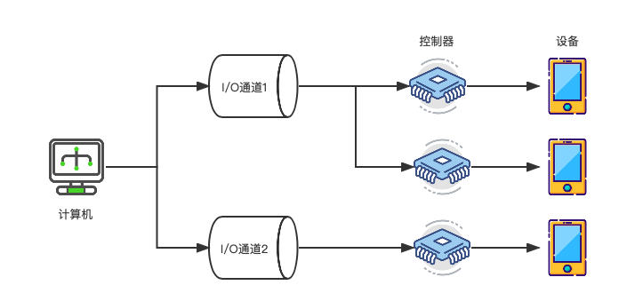
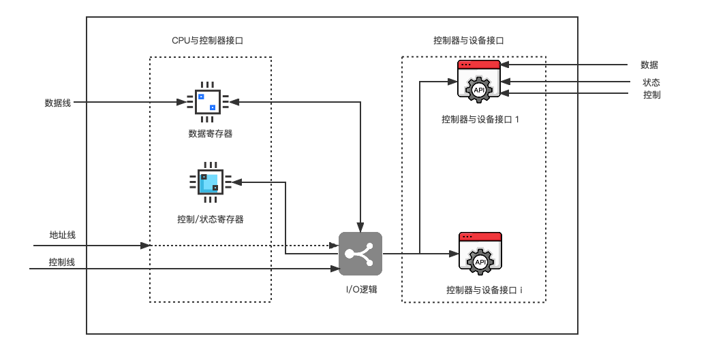

I/O 系统不仅包括各种 I/O设备，还包括与设备相连的设备控制器，有些系统还配置了专门用于输入/蔬菜长控制的计算机，即通道。此外， I/O 系统要通过总线与 CPU，内存相连。

# 操作系统

##  I/O设备管理

### I/O 系统的结构

#### 微机 I/O 系统
> CPU 与内存之间可以直接进行信息交换，但不能直接与设备进行信息交换，必须经过设备控制器。

{: .mx-auto.d-block :}
#### 主机 I/O 系统
> I/O 系统可以分为四级结构，包括 主机，通道，控制器 和 设备。一个通道可以控制多个设备控制器，一个设备控制器也可以控制多个设备。

{: .mx-auto.d-block :}

### I/O 设备的分类

#### 按传输速率分类

- 低速设备(传送速率：几个 ～ 几百个字节 / 秒 )
> 键盘，鼠标

- 中速设备(传送速率：数千 ～ 数万个字节 / 秒 )
> 打印机

- 高速设备(传送速率：几十万 ～ 几兆字节 / 秒 )
> 磁带机，光盘机

#### 按信息交换的单位分类

- 块设备
> 数据的存钱以块为单位，如磁盘。

- 字符设备
> 传送字节流，没有使用块结构。

#### 按设备的共享属性分类

- 独占设备
> 必须作为临界资源互斥访问的设备。

- 共享设备
> 允许多个进程共同访问的设备。

- 虚拟设备
> 通过某种虚拟技术把一台物理设备变成若干逻辑设备，从用户的角度看，多个设备拥有各自的设备，可随时向设备发起访问请求，并得到系统应答。

### 设备控制器

I/O 设备分为机械和电子两部分，设备控制器对应电子部分，通常是可编程的。

#### 什么是设备控制器

设备控制器是CPU与I/O 设备之间的接口，接收 I/O 的命令，并控制设备完成 I/O 工作。

设备控制器是一个可编址设备，连接多个设备时，可以有多个设备地址。

#### 设备控制器的功能

##### 接收和识别命令
接受CPU的命令，参数存放在控制器的控制寄存器，并对命令和地址译码。

##### 数据交换
通过数据寄存器进行数据交换。

1. 将驱动器中的比特流汇集在控制器的缓冲区以形成字节块。
2. 实现CPU到控制器，控制器到CPU的双向数据传输。
3. 将控制器对设备的控制命令传送给设备控制器。

##### 设备状态的了解和报告
设备控制器中有专门用来存放设备状态信息和或出触发器，CPU通过读取这些信息了解当前设备的状态。

##### 地址识别
1. 设备控制器必须能识别它所控制的每个设备的地址。
2. 设备控制器中寄存器本身应该是一个唯一的地址，使CPU能向寄存器中读，写数据。
3. 将CPU要访问的外设备地址输入控制器。由控制器的地址译码器译码后选择目标设备。

##### 数据缓冲
在设备控制中可以存储数据，作为 CPU 和 I/O 直接的缓冲。

##### 差错控制
设备控制器需要具有差错检测功能，当通过数据校验后发现数据传输错误，可以向CPU报告，废弃错误数据，并启动一次数据传输。

#### 设备控制器的组成

{: .mx-auto.d-block :}

1. 设备控制器与处理机的接口：数据线，控制线，地址线
2. 设备控制器与设备的接口：设备与设备控制器接口中的3种信号为数据，状态，控制信号。
3. I/O逻辑：I/O逻辑主要由指令译码器和地址译码器两部分构成，将CPU的命令和地址分别译码，控制指定设备进行I/O操作。

