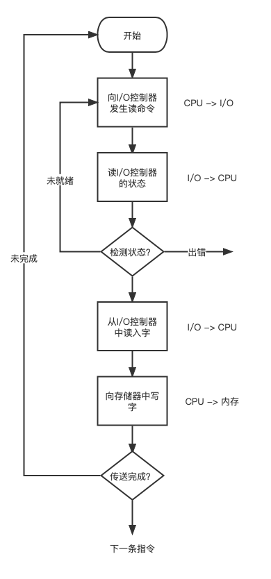
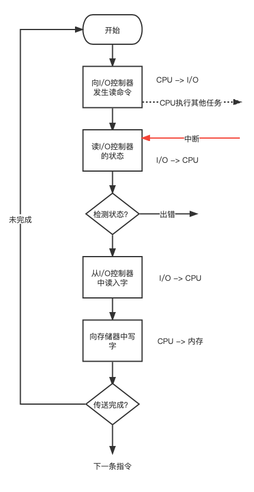
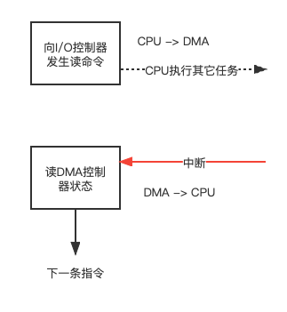
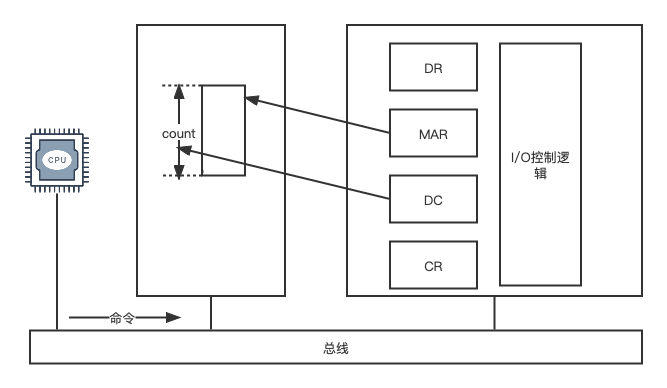
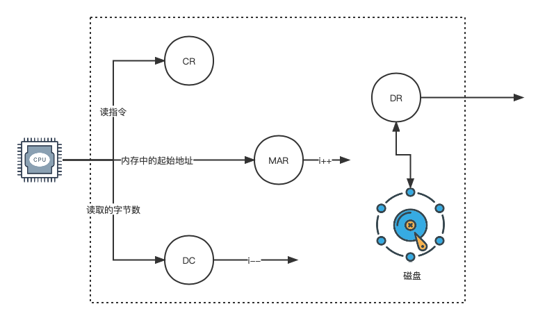

输入、输出方式有早期的程序轮询控制方式。在引入中断机制的计算机系统后，输入，输出采用中断控制方式。为了提高块设备的输入，输入性能，可以利用 DMA（Direct Memory Access）控制器对输入，输出进行DMA控制。

# 操作系统

##  I/O 控制方式

### 轮询

{: .mx-auto.d-block :}

采用这种控制方式，主机试图发送 I/O 控制命令之前，先通过反复检测设备控制器状态寄存器的忙/闲标志位，若设备为 “忙”，主机则继续检测改标记位，直到改位为“空闲”，主机发送I/O指令。
在主机发送完 I/O 指令后，设备控制器把状态寄存器的忙闲标志位再设置成忙，主机再次进入轮询状态，以检查本次输入输出是否结束。

### 中断
{: .mx-auto.d-block :}

采用中断控制方式的I/O工作模式，是CPU执行进程中，发出输入/输出请求，若此时I/O设备忙，则进程阻塞等待。当忙状态的设备工作完毕后，通过中断控制器发送中断请求信号，CPU响应中断，执行对应设备的中断处理程序，然后唤醒因等待设备而被阻塞的进程。CPU继续执行证进程时，向设备控制器发送I/O指令，然后CPU被调度程序分配给某个进程，继续执行某个程序。自此，在设备控制器控制设备完成本次I/O的过程中，I/O与CPU并行。

### DMA

对应磁盘驱动器这类的设备，每次数据数据传输量较大，采用中断方式，传输一个数据块需要中断多次。
典型情况下，一个数据块大小 512B ，采用中断方式，若磁盘控制器中数据寄存器为一个字节大小，每次传输完成一个字节，就需要CPU执行一次中断处理。

{: .mx-auto.d-block :}

为了进一步提高 I/O 的速度，和CPU与I/O的并行度，可以采用DMA方式。

DMA 控制需要特殊结构的控制器，DMA 控制器的逻辑结构包括3个部分：主机与DMA的接口，DMA与设备的接口，以及I/O逻辑控制。

为了实现主机与设备之间成块数据的传输，在DMA中设计了4类寄存器：命令/状态寄存器CR，内存地址寄存器MAR，数据寄存器DR，数据计数器DC。

{: .mx-auto.d-block :}

#### 命令/状态寄存器CR
用于接受从CPU发来的I/O命令或有关控制信息，设备状态。

#### 内存地址寄存器MAR
存放内存地址，在输出数据时，存放输出数据在内存的起始地址，指示DMA应该从内存的什么位置开始读取输出数据。在输入数据时，存放输入数据将要被放入内存的起始地址，指示DMA应该把输入数据放在内存的什么位置。

#### 数据计数器 DC
指示DMA，本次向CPU发送中断信号前要读写数据的次数。

#### 数据寄存器 DR
用于暂存传输中要输入，输出的数据。

#### DMA的工作流程

{: .mx-auto.d-block :}

当CPU要从磁盘上读入一个数据块时，便向磁盘控制器发送一条读命令。该命令被送入其中的命令寄存器（CR）中。

同时，CPU将本次读入数据将要放在内存的地址起始地址送到DMA的MAR寄存器中。

要将本次要读取的字节数放入DC寄存器中。

然后，启动DMA控制器进行数据传送，在 DMA 控制输入的过中，CPU 可以执行器其它进程。

当本次读入的数据全部传送完毕后，DMA 向 CPU发送中断请求。

> 在DMA控制磁盘读入数据的过程中，每读入一个字，便将该字送到当前MAR指示的内存单元中，然后MAR的值递增，以指向下一个内存单元。 DC 减1，若DC递减后的值不为0，说明本次数据传送没有结束，继续在DMA控制下传送下一个字节。若，DC 递减后为 0 ，说明本次传送结束，由DMA向CPU发送中断。

