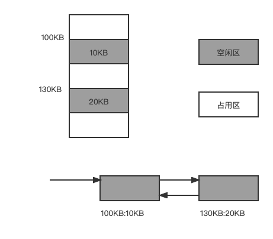

动态分区分配是根据进程的实际需要，为进程分配大小合适的内存区域，系统中的用户分区的数量和大小都是动态变化的。

# 操作系统

##  内存管理

### 动态分区分配原理

系统初始化只有个大空闲区，当进程请求空间时，由系统根据进程需要空间的大小划分出一片空闲区分配给进程。系统运行一段时间后，内存的空闲区可能散布在不连续的区域，系统维护一个记录当前空闲分区的数据结构，当进程请求内存时，系统从所有空闲区域中找到大小合适的空闲分区进行分配。系统中分区的大小和数量都是变化的，空闲区的大小和数量也是变化的。

### 动态分区分配中的数据结构

**（1）空闲分区表**

系统在空闲分区表中为每一个空闲分区建立一个表项，每个表项包括分区编号，分区大小和分区起始地址。

使用空闲分区表的缺点是，若设置太多表项，会浪费内存空间；设置太少表项，当空闲分区较多时，无法记录所有空闲分区的情况。在实现时，结构数组的大小不容易确定。

| 分区编号 | 分区大小（KB） | 分区起始地址（KB） |
|:----:|:--------:|:----------:|
|      |          |            |
|      |          |            |

**（2）空闲分区链** 

使用空闲分区链可以动态的为每一个空闲分区建立一个节点，每个节点包括分区大小，分区起始地址，指向前一个空闲分区结点的指针。空闲分区链表中每一个节点都可以动态分配和动态回收。

{: .mx-auto.d-block :}

**（3）动态分区分配算法**

**首次适应算法FF(First Fit)**

在采用空闲分区链作为数据结构时，首次适应算法要求空闲分区链以地址递增的顺序链接。在进行内存分配时，从链首开始顺序查找，直到找到一个满足进程大小要求的空闲分区为止。然后，在按照进程请求的内存大小，从该分区中划出一块内存空间分配给请求者，余下的空闲分区仍然留在空闲链表中。

该算法总是先分配低地址部分的内存空间，容易使低地址部分留下小分区，而高地址部分大空闲区较多。当进程请求大内存空间时，要找的合适的分区，搜索空闲分区需要的时间开销比较大。

此外，由于较低地址部分的空闲分区被反复划分，可能留下许多难以利用的很小的空闲分区，这种难以被利用的分区称为外部碎片或外碎片。分配给进程的分区若大于请求空间，分区内会存在一部分不被利用的空间，这部分浪费的空间称为内部碎片或内碎片。

**循环首次适应算法NF(Next Fit)**

该算法是由首次适应算法演变而形成的。在为进程分配内存空间时，不再每次从链首开始查找合适的空闲分区，而是从上一个找到的空闲分区的下一个空闲分区开始查找，直到找到第一个满足要求的空闲分区，并从中划出一块与请求大小相等的内存空间分配给进程。

为实现该算法，应设置一个起始查找指针，以指向下一次起始查找的空闲分区，采用循环查找方式。循环首次适应的算法优点是：空闲分区分布均匀，查找开销小。缺点是容易过使系统缺乏大空闲区。

**最佳适应算法BF（Best Fit）**

该算法每次为作业分配内存，总把大小与进程所请求大小最接近的空闲分区分配给进程，避免了“大材小用”，为了加速查找，该算法要求将所有空闲分区按照分区大小递增的顺序形成一个空闲分区链，这样第一次查找到满足要求的空闲分区必然使大小最接近进程需要的内存空间大小。

最佳适应算法的优点避免了大材小用，提高了内存的利用率，但是，采用最佳适应算法容易留下难以利用的小空闲区。

