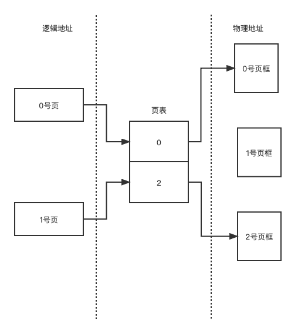
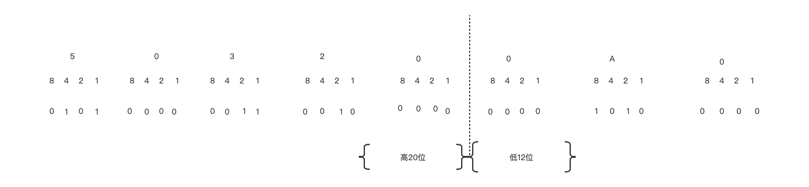

把进程离散的存储在内存中的物理地址不连续的区域中，这种内存管理的方式称为离散内存管理方式。为了支持虚拟内存管理，需要引入离散内存管理方式。根据离散内存管理分配内存空间的基本单位的不同，将其分为3种不同的管理方式：分页存储，分段存储，段页式存储管理。

# 操作系统

##  内存管理

### 基本概念

_**（1）页**_

将一个进程的逻辑地址空间分成若干大小相等的片，称为页。

_**（2）页框**_

将物理内存空间分成与页大小相等的若干存储块，称为页框或页帧。

_**（3）分页存储**_

在为进程分配内存时，以页框为单位将进程中的若干页分别装入多个可以不相邻的页框中。

_**（4）页内碎片**_

进程的最后一页一般装不满一个页框，而形成的不可利用的碎片，称为页内碎片。

_**（5）页表**_

页表时系统为进程建立的数据结构，页表的作用时实现从页号到页框号的映射。

{: .mx-auto.d-block :}

### 地址结构

基本分页的逻辑地址结构包括两部分：页号$P$ 和页内偏移量 $W$ 。若用 m 位表示逻辑地址，页大小为 $2^n$ 字节，则用低 n 位表示页内偏移量 $W$,用 $m-n$ 表示页号 $P$。

{: .mx-auto.d-block :}
以 32位地址为例：0～11 位表示页内偏移量，n = 12，页大小 = 页框大小 = $2^{12}$ = 4KB。12～31 位表示页号，共 $2^{20}$个页即1M页，这种逻辑地址可以表示 4G 的逻辑地址空间。

若A为逻辑地址，L为页大小，P位页号，W为页内偏移量，则有以下计算关系。

$$
P=INT(A/L)
$$

$$
W=MOD(A/L)
$$

已知逻辑地址空间 A为 $0_x 503200A0$ ,求页号与页内偏移量。页号为 $0_x 50320$  ，页内偏移量为  $0_x A0$ 

{: .mx-auto.d-block :}

### 分页地址变换

为了能将用户的地址空间中的逻辑地址转换为内存空间中的物理地址，在系统中必须设置地址变换机构，该机构的基本任务是实现逻辑地址到物理地址的变换。

地址变换过程如下：

1. 进程执行，PCB 中页起始地址和页表长度送CPU的页表寄存器。
2. CPU 访问逻辑单元A。
3. 由分页地址变换硬件自动将 A 分为页号和页内偏移量两部分。
4. 由硬件检索页表，得到A所在的页框号。页号对应页表项的起始地址 = 页表起始地址 + 页表长度 $\times$ 页号。从该地址读取页框号。
5. 页框号和页内偏移量地址送物理地址寄存器，计算物理地址。物理地址 = 页框大小 $\times$ 页框号 + 页内偏移量。

### 页大小的选择

**归纳影响页大小设计的因素如下：**

（1）.内存管理的开销。

选择较小的页，会导致进程划分较多的页，页表过长，占用大量的内存空间。同时，进程的缺页率和置换率都会比较高，内存管理的时间开销相对大。

（2）.内存利用率。

选择较小的页，有利于提高内存的利用率，但是存在（1）所述的缺点。较大的页可以克服（1）的缺点，但是，页内碎片大，空间利用率降低。（页大小一般时2的整数次幂，大小为 512B ～4KB）。

