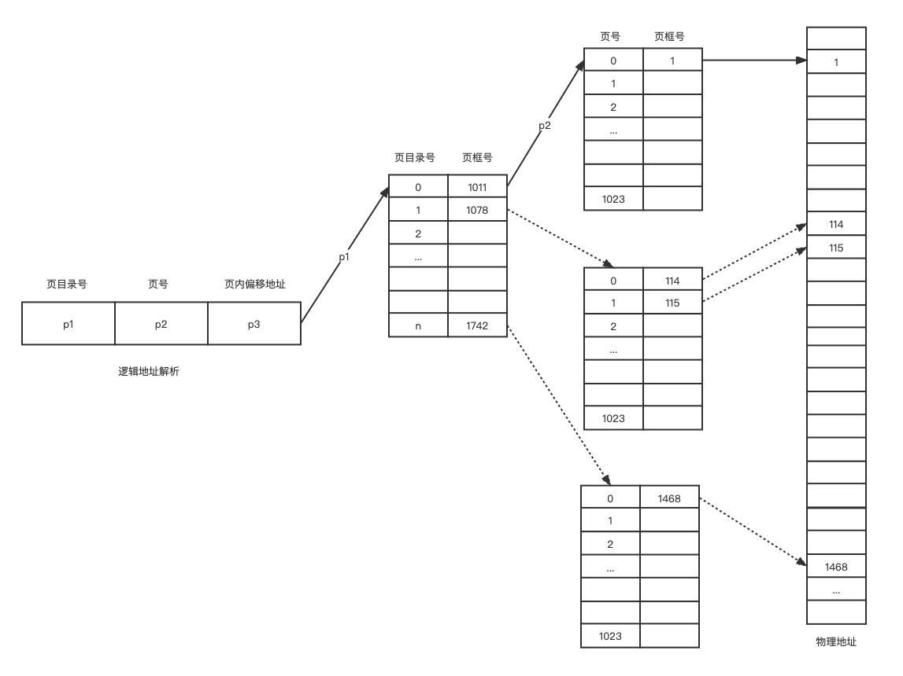

目前使用的计算机系统都允许非常大的进程页表，一个页表中的页表项多达上百万个，把这么大的页表放入的寄存器中显然是不合适的，所以，现在计算机系统基本上都把页表放入内存中。

# 操作系统

##  内存管理

### 快表

快表也称转换后援缓冲（Translation Look-aside Buffer）TLB,为了提高CPU的的访问速度而采用的专用缓存，用来存放最近被访问过的页表项。TLB 关联的是快速缓存。

TLB的条目有两部分构成：键 和 值。键对应页号，值对应页框号。

**TLB 的变化过程：**

1). CPU 产生分页的逻辑地址号和页内偏移量后，将逻辑地址的页号提交给TLB。

2). 查找TLB，如果查找到页号，则把该页所在的页框号用于形成物理地址。否则（TLB失效）查询内存页表，从内存页表中找到相应页表项，读取页所在的页框号，形成物理地址。

3). 如果所查找的页表项不在TLB中，在访问完成内存页表后，再把找到的页表项中的页号和页框号写到TLB中。如果TLB中的条目已满，系统会根据某种策略选择一个TLB中的条目，用刚访问的页表项信息替换选中的这个条目。

**TLB的性能分析**

在TLB表中找到某个页号对应页表项的百分比称为TLB命中率。

**有TLB的有效访问时间 = 一次访问TLB的时间 + 一次访问内存的时间**

**无TLB的有效访问时间 = 两次访问内存的时间**

### 两级和多级页表

基本分页存储的3个知识点：

1. 每一个进程有一个页表。
2. 每个页表至少包括与进程页数相同的页表项。
3. 页表必须是连续的。

> 如果操作系统支持的页大小为 4KB，那么在32位的操作系统中每个进程可以拥有 4GB/4KB = 1M 个页。相应的，页表中至少需要1M个页表项。如果每个页表项要求的长度为4个字节，那么一个进程页表需要 $1M \times 4B = 4MB$ 的连续物理空间来存储。

从系统性能考虑，不希望这么大的联系地址空间存放页表，解决办法就是把页表再分表，形成两级别和多级页表。

**两级页表**

两级页表就是将页表再进行分，_使每个页表分页大小与内存页框数的大小相同_，并为它们编号。将这些页表分表放入不同的，不一定相邻的页框中，为离散分配的页表再建立一张外层表（页目录表）。

> 使用二级页表时，上面👆提到的 4MB 大小的页表分成 1024 个页表分页，这 1024 个页表分页中包括的是_页表_项，页表分页称为页表。每个页表占 4KB 空间，连续存储。不同的页表可以离散的存放在不连续的物理空间中。

在二级分页系统中，为了能在地址映射时得到离散存放的页表的物理内存中的地址，需要为页表建立一个连续存放的外层表，称为页目录表。表中的项包括 页目录号，页号，页内偏移量地址。

**两级页表的寻址**

使用两级页的系统，当进程切换时，要运行的进程的页目录表起始地址被写入CPU寄存器，称为页表寄存器，地址映射过程如下：

1. 对于给定的逻辑地址A，由硬件从中分离出页目录号 $p_1$,页号 $p_2$, 页内地址  $d$。
2. 有页表寄存器的值和页目录号 $p_1$,从存放页目录的页框中找到页表所在的页框号 $p_2$。页表所在的页框号在内存中的地址 = 页目录起始地址 + $p_1 \times$ 页表长度，从该地址指示的物理内存单元中读取_页表所在的页框号。_
3. 由页表所在的页框号和页号$p_2$ ,从存放页表的页框中找到进程页所在的页框号。进程所在的页框号在内存中的地址 = 页表的起始地址（页表所在的页框号 $\times$ 页框大小） + $p_2 \times$ 页表项长度。
4. A的物理地址 = 进程所在的页框号 $\times$ 页框大小 + 页内地址 $d$。

{: .mx-auto.d-block :}

